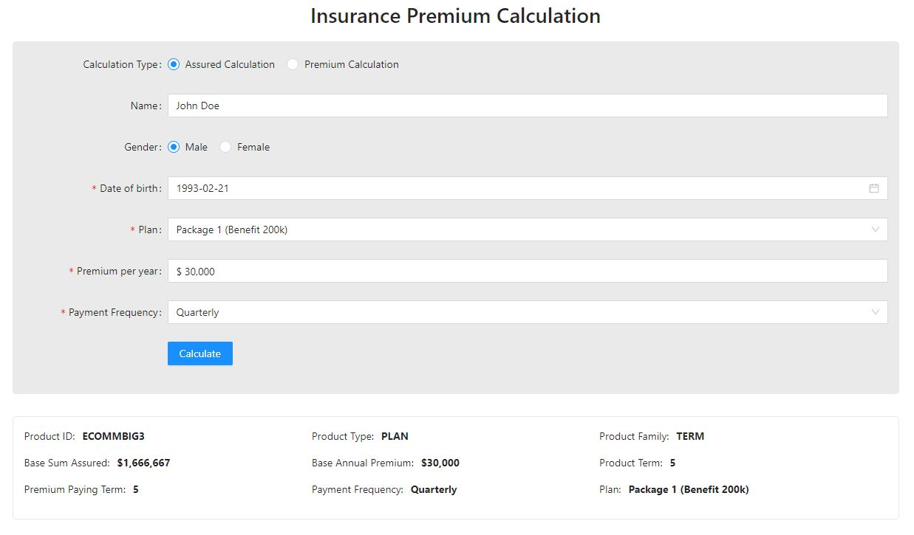

# Insurance Calculation - ReactJS & NodeJS Test

## Overview

Create ReactJS web application and NodeJS BFF (TypeScript) for insurance premium calculation.

## Screenshot


## Make .env file
```
cp .env.example .env
```

## DEVELOPMENT

```
docker-compose up --build
```

## REMOVE DOCKER IMAGES & CONTAINERS
```
docker-compose down
```